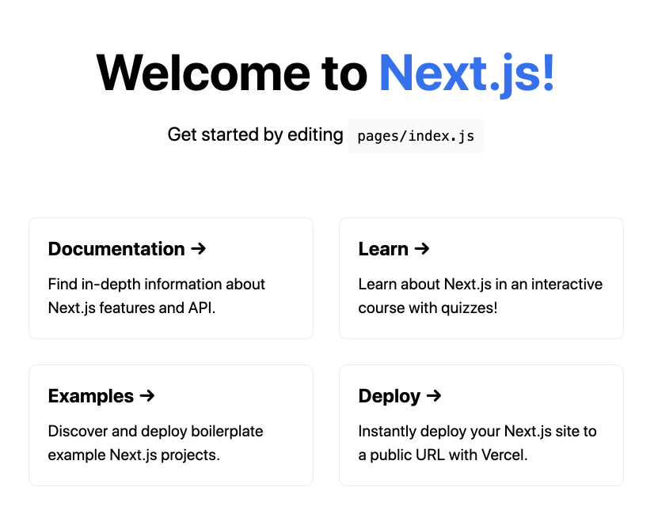
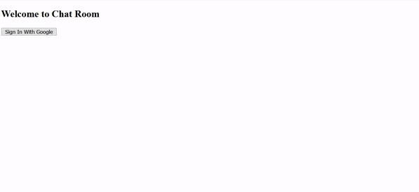
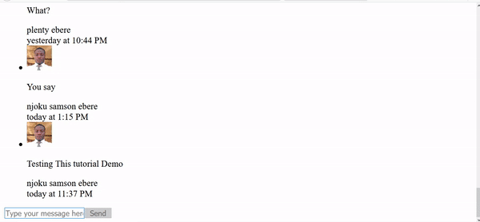
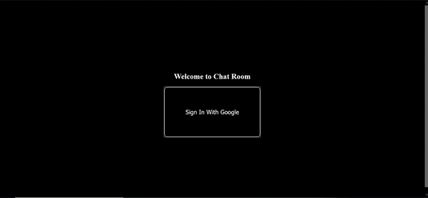

[Next.js](https://nextjs.org) is a full stack framework built with JavaScript. In simpler terms, it's a combination of React library and Express Framework. If you are coming from a React background, then picking up Next.js will be relatively simple. In this tutorial, we'll show you how to build a simple chat application using Next.js and Firebase.

## How to install Next.js
Before proceeding with this, ensure you have `Node.js 10.13` or later in stalled in your machine.

To install Next.js, run the following command in your terminal

`npx create-next-app`

## Create a Next.js project
Let's create a Next.js boiler plate for the chatApp we are about to build. To do that, run the following command

`npx create-next-app next-chat-app`

Ensure you use the default settings when creating the project

## Preview the project you just created
To get a preview of our project at the moment, we do the following:

- Open the project in a terminal or just navigate into the project folder from the terminal
<br>`cd next-chat-app`

- Start the server
<br>`npm run dev`

This loads the project in your default browser like so:



## Building out chat app
The chat application we are going to build will be made up of four features (sign in, sign out, view chat and send message).

This tutorial assumes you already have basic knowledge of Firebase, React and date-fns.
Now, let's get to work...

## Installing dependencies
This project will be depending on date-fns for date/time manipulation/formatting and Firebase for back-end purpose. To install them, run the following command:

`npm i date-fns firebase`

## Initial setup
At this point, we want to get our project ready for what we are about to build. Do the following with me:

- Open the project we just created in your choice editor
- Navigate to the `pages/index.js` file
- Replace the code there with the following code:
```js
const Home = () => {

  return (
    <div className="container">

    </div>
  );
}

export default Home
```
- Import the following at the top of the file
```js
import { useEffect, useState } from "react";
import { initializeApp } from "firebase/app";
import { getAuth } from "firebase/auth";
import { getFirestore } from "firebase/firestore";
```
- Create a firebase project and get your configuration code
- Initialize firebase below the imports like so:
```js
// initialization
const app = initializeApp({
    apiKey: process.env.apiKey,
    authDomain: process.env.authDomain,
    projectId: process.env.projectId,
    storageBucket: process.env.storageBucket,
    messagingSenderId: process.env.messagingSenderId,
    appId: process.env.appId,
    measurementId: process.env.measurementId,
})

const auth = getAuth();
const firestore = getFirestore();
```
> Do not forget to replace the configuration with your own configuration

## Authenticating a user
We want to be able to automatically check if a user is logged in or not. To be able to do this, we will use the `onAuthStateChanged` method provided for us by firebase.

- So we begin by creating an initial state for the `user` just above the return statement like so:
 `const [user, setUser] = useState(() => auth.currentUser);`

- Next we auto-check the state of the user and update the state appropriately with the following code
```js
useEffect(() => {
    auth.onAuthStateChanged((user) => {
      if (user) {
        setUser(user);
      } else {
        setUser(null);
      }
    });
  }, []);
```
But something has to trigger the user's state change. Yes! We need to sign in or sign out for that to happen. Let's create those!

## Sign in
We will be using the `signInWithPopup` feature provided by firebase. So enter the following code above the return statement

```js
const signInWithGoogle = async () => {
    const provider = new firebase.auth.GoogleAuthProvider();
    auth.useDeviceLanguage();

    try {
      await auth.signInWithPopup(provider);
    } catch (error) {
      console.log(error);
    }
  };
```
### Sign out
Since we are logging in a user, it will make sense if we allow them leave sometimes when they want. At least for security purpose you know. So let's sign out a user using the following code

```js
const signOut = async () => {
    try {
      await firebase.auth().signOut();
    } catch (error) {
      console.log(error.message);
    }
  };
```
### Rendering the authentication component
You will notice that so far, the functions we have been creating are useless because nothing triggers them. Now we want to trigger these functions depending on the user's authentication state. We will use 2 buttons (one for the sign in and the other for the sign out).

- Enter the following code within the `div` tag
```js
{user ? (
          <>
            <nav id="sign_out">
              <h2>Chat With Friends</h2>
              <button onClick={signOut}>Sign Out</button>
            </nav>
          </>
        ) : (
          <section id="sign_in">
            <h1>Welcome to Chat Room</h1>
            <button onClick={signInWithGoogle}>Sign In With Google</button>
          </section>
        )}
```
The code above displays the `sign out` button if a user is already signed in and it displays the `sign in` button if a user is signed out.

Check your browser for update. See mine below:




### Viewing and sending chat messages
Now the moment we all have been waiting for is here. In this part, we will be able to send messages to our firestore database in firebase and view the messages in `real time`.

Let's begin by creating this component. Create a file and name it `Components/ChatRoom`

- Enter the following code in the file
```js
import { useEffect, useRef, useState } from "react";
import firebase from "firebase/app";
import "firebase/firestore";
import { formatRelative } from "date-fns";

export default function ChatRoom(props) {
  return (
    <main id="chat_room">

    </main>
  );
}
```
### Send messages
To send messages, we will add an empty section and a form in the return statement. The form will have an input box and a button like so

```js
<section ref={dummySpace}></section>

      <form onSubmit={handleSubmit}>
        <input
          type="text"
          value={newMessage}
          onChange={(e) => setNewMessage(e.target.value)}
          placeholder="Type your message here..."
        />

        <button type="submit" disabled={!newMessage}>
          Send
        </button>
      </form>
```
The empty section is used to automatically scroll down to the most recent message after a new message is sent

- Next, let's get the database, user details, dummy space and set an initial state for `newMessage` above the return statement like so:
```js
 const db = props.db;
  const { uid, displayName, photoURL } = props.user;

  const dummySpace = useRef();

  const [newMessage, setNewMessage] = useState("");
```
The `db` and `user` will be passed from the pages/index.js file

- Still above the return statement, we will define a function that will be triggered anytime the form is submitted. Enter the following code
```js
const handleSubmit = (e) => {
    e.preventDefault();

    db.collection("messages").add({
      text: newMessage,
      createdAt: firebase.firestore.FieldValue.serverTimestamp(),
      uid,
      displayName,
      photoURL,
    });

    setNewMessage("");

    // scroll down the chat
    dummySpace.current.scrollIntoView({ behavor: "smooth" });
  };
```
In the code above, anytime a message is sent, the text of the message, time/date and user details is collected and saved to a collection called messages. It then clears the input box and scrolls down the chat to the newest message

### View chat messages
We want to view messages but not by continuously refreshing the page manually. We want it to happen without refreshing the page and we also want to see the message as soon as it is sent.

In order to achieve that, we will enter the following code above the return statement

```js
const [messages, setMessages] = useState([]);

  useEffect(() => {
    db.collection("messages")
      .orderBy("createdAt")
      .limit(100)
      .onSnapshot((querySnapShot) => {
        const data = querySnapShot.docs.map((doc) => ({
          ...doc.data(),
          id: doc.id,
        }));

        setMessages(data);
      });
  }, [db]);
```
The code above collects all the messages from the database, sort the messages by `createdAt` field and limits the messages to be displayed to 100

- Now to render the messages, add the following code just above the dummy space in the return statement
```js
<ul>
        {messages.map((message) => (
          <li key={message.id} className={message.uid === uid ? "sent" : "received"}>
            <section>
              {/* display user image */}
              {message.photoURL ? (
                
              ) : null}
            </section>

            <section>
              {/* display message text */}
              <p>{message.text}</p>

              {/* display user name */}
              {message.displayName ? <span>{message.displayName}</span> : null}
              <br />
              {/* display message date and time */}
              {message.createdAt?.seconds ? (
                <span>
                  {formatRelative(
                    new Date(message.createdAt.seconds * 1000),
                    new Date()
                  )}
                </span>
              ) : null}
            </section>
          </li>
        ))}
      </ul>
```
In the code above, loops through all the messages collected and outputs each message and the user's details. One more thing, let's add our `ChatRoom` component to the `pages/index.js` file

- Import the component like so:
import ChatRoom from `"../Components/ChatRoom"`;

- Add the component just below the `nav` tag like so:
```js
<>
            <nav id="sign_out">
              <h2>Chat With Friends</h2>
              <button onClick={signOut}>Sign Out</button>
            </nav>

            {/* chat room component */}
            <ChatRoom user={user} db={db} />
          </>
```
Notice that it is at this point that we pass the user and `db` props down to the `ChatRoom` component

You can check your project in your browser now and try sending messages. See mine below




Looks cool! Yeah?

But it looks a bit unkempt. Let's add some CSS to our `styles/global.css` file to style the app

```css
body {
  background-color: black !important;
  color: white;
}

/* sign in */
#sign_in {
  height: 100vh;

  display: flex;
  flex-direction: column;
  align-items: center;
  justify-content: center;
}

#sign_in button {
  padding: 5%;
  cursor: pointer;
  border-radius: 10px;
  font-size: 1.2rem;
}

#sign_in button:hover {
  border: 1px solid white;
  background-color: transparent;
  color: white;
}

/* sign out */
#sign_out{
  overflow: hidden;
  position: fixed;
  top: 0;
  width: 100%;
  text-align: center;
  background-color: black;
  border-bottom: 1px solid white;
  padding-bottom: 1%;
}

#sign_out button{
  padding: 1%;
  background-color: red;
  border-radius: 10px;
  border: 0;
  cursor: pointer;
}

#sign_out button:hover{
  border: 1px solid red;
  background-color: transparent;
  color: white;
}

/* chat */
#chat_room{
  margin-top: 10%;
  margin-bottom: 5%;
}

#chat_room li{
  list-style-type: none;
}

#chat_room section{
  display: inline-block;
}

.received section:last-child{
  margin-left: 5%;
}

.sent section:last-child{
  margin-right: 5%;
}

#chat_room span{
  color: gray;
}

#chat_room img{
  border-radius: 10px;
  height: 70px;
  width: 70px;  
  margin-top: 5%;
}

/* form */
form{
  position: fixed;
  left: 0;
  bottom: 0;
  width: 100%;
}

form input{
  width: 80%;
  height: 40px;
}

form button{
  width: 19.5%;
  height: 48px;
}

/* message */
.sent{
  display: flex;
  flex-direction: row-reverse;
}
```
This is what my app looks like now



The source code of the simple chat application we just built can be found [here](https://github.com/houssaineamzil).

